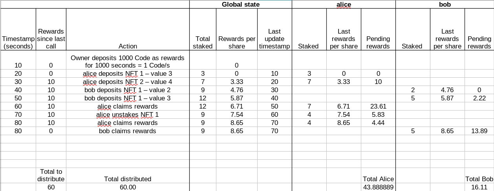

# SUI NFT STAKING

## Overview

This project implements an NFT staking system on the Sui blockchain where users can stake their PFP NFTs to earn CODE token rewards. The staking mechanism features a rarity-based reward multiplier system that incentivizes staking rarer NFTs.

### Reward Multiplier System

Every staked NFT has a reward multiplier according to its rarity:
- **Common**: 1x multiplier
- **Rare**: 2x multiplier  
- **Epic**: 3x multiplier
- **Legendary**: 4x multiplier

This means that staking a Legendary NFT will earn 4 times more rewards than staking a Common NFT over the same time period. The system calculates rewards based on the total staked value across all users, ensuring fair distribution while rewarding rarity.

### Reward Distribution Mechanism

Rewards are distributed continuously on a per-second basis from a shared reward pool. Each staker's share of the rewards is proportional to their contribution to the total staked value in the pool. For example, if the total staked value is 100 and you have staked NFTs worth 10 points, you'll receive 10% of the rewards distributed each second. This creates a dynamic and fair reward system where your earnings depend on both the rarity of your staked NFTs and the overall participation in the staking pool.

## Setup Instructions

#### PUBLISH:
```bash
sui client publish --gas-budget 100000000
```

#### CALL SET_COLLECTION FUNCTION (change package name and minter cap after publishing):
```bash
sui client call \
--package 0x11c28eef71a26d572c09d67baf01252b8946d41d61b76701172416cb2cbe5089 \
--module PFP_NFT \
--function set_collection \
--args "0xb12e8d1e1a178f7055e60a8f100219419aaaedd3201ec081c7be525ed194b6a3" \
"0x2c4793240066f5b9f9b2dc07a8024329579b374a8a3361b2120221e30dba3ef0" \
"Common" \
"https://i.imgur.com/TYekL74.png" \
"Rare" \
"https://i.imgur.com/9Lu930k.png" \
"Legendary" \
"https://i.imgur.com/NkSyJjT.png" \
"Epic" \
"https://i.imgur.com/C965eRh.png" \
--gas-budget 100000000
 
```

#### CALL MINT FUNCTION (change package name and minter cap after publishing):
```bash
sui client call \
--package 0x11c28eef71a26d572c09d67baf01252b8946d41d61b76701172416cb2cbe5089 \
--module PFP_NFT \
--function mint \
--args "0x8179bdabfe31593f77d9132d4d3ab39ca179e7d07bf1e0778e187f5078d9945b" \
"0x2c4793240066f5b9f9b2dc07a8024329579b374a8a3361b2120221e30dba3ef0" \
"0x8" \
--gas-budget 100000000
 
```

 
Collection on chain: https://suiscan.xyz/testnet/collection/0x97d7b904a8eae1bab03d5ce6e2f0c7ed42840d5d6c80639a52f2e4a38870197f::PFP_NFT::PFP/items 
Collection image:   "https://imgur.com/nWGBDqQ" \
Common url:         "https://i.imgur.com/TYekL74.png" \
Rare url:           "https://i.imgur.com/9Lu930k.png" \
Legendary url:      "https://i.imgur.com/C965eRh.png" \
Epic url:           "https://i.imgur.com/NkSyJjT.png"


### Staking Scenario Tested:


